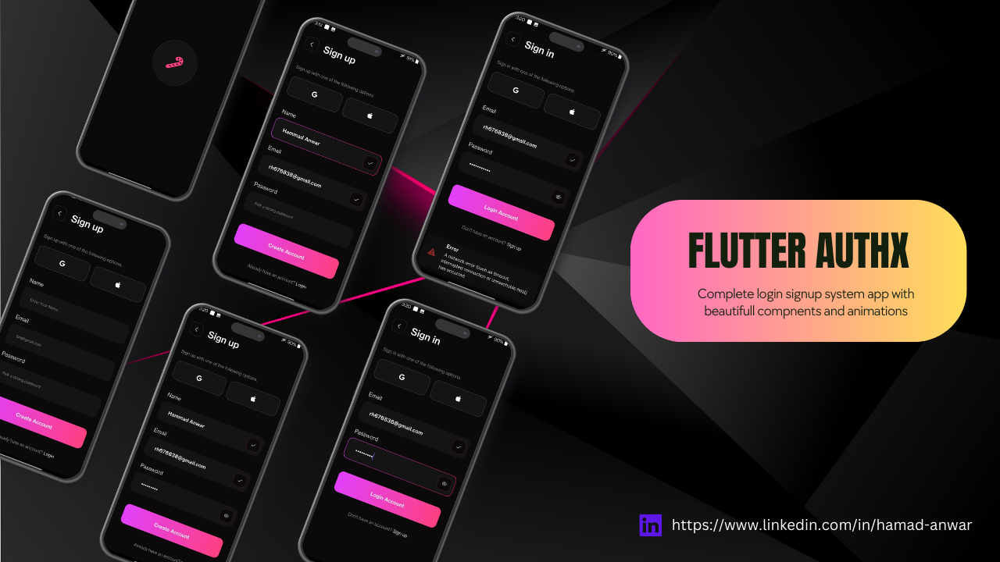

# Flutter AuthX Firebase Authentication

Simplify authentication and session management in your Flutter app with Firebase integration and Realtime Database support.Save time on authentication setup in your Flutter apps! Presenting an easy-to-integrate login creation system with Firebase and efficient session management using Shared Preferences.

## Features
- Firebase Authentication: Secure user sign-up, login, and management.
- Realtime Database: Store and retrieve user data in real-time.
- Session Management: Seamlessly manage user sessions using Shared Preferences.
- Easy Integration: Step-by-step guide for swift project integration.

## Screenshot 



## Getting Started

Follow these steps to set up Firebase authentication and Realtime Database in your Flutter app:

### Setup Firebase

1. **Create a Firebase Project:**
   - Go to the [Firebase Console](https://console.firebase.google.com/) and create a new project.
   - Follow the instructions to set up your project.

2. **Add an Android App:**
   - Click on the "Android" icon and follow the setup instructions.
   - Download the `google-services.json` file and add it to the `android/app` directory of your Flutter project.

3. **Add an iOS App (if required):**
   - Click on the "iOS" icon and follow the setup instructions.
   - Download the `GoogleService-Info.plist` file and add it to the `ios/Runner` directory of your Flutter project.

### Setup Realtime Database

4. **Initialize Firebase in your Flutter App:**
   - Add the necessary dependencies to your `pubspec.yaml`:
     ```yaml
     dependencies:
       flutter:
         sdk: flutter
       firebase_core: ^latest_version
       firebase_database: ^latest_version
     ```
   - Import and initialize Firebase in your `main.dart`:
     ```dart
     import 'package:firebase_core/firebase_core.dart';

     Future<void> main() async {
       WidgetsFlutterBinding.ensureInitialized();
       await Firebase.initializeApp();
       runApp(MyApp());
     }
     ```
4. **Add `google-services.json`:** For Firebase setup, each developer needs to add their own `google-services.json` file obtained from their Firebase project. Place this file in the `android/app` directory.

5. **Use Realtime Database:**
   - Import the necessary package:
     ```dart
     import 'package:firebase_database/firebase_database.dart';
     ```
   - Read and write data to the database:
     ```dart
     final DatabaseReference _database = FirebaseDatabase.instance.reference();
     _database.child('users').child(userId).set({
       'username': 'john_doe',
       'email': 'john@example.com',
     });
     ```

### Setup Firebase Authentication

6. **Use Firebase Authentication:**
   - Import the necessary package:
     ```dart
     import 'package:firebase_auth/firebase_auth.dart';
     ```
   - Implement authentication methods:
     ```dart
     final FirebaseAuth _auth = FirebaseAuth.instance;

     // Sign Up
     UserCredential userCredential = await _auth.createUserWithEmailAndPassword(
       email: 'user@example.com',
       password: 'password123',
     );

     // Sign In
     UserCredential userCredential = await _auth.signInWithEmailAndPassword(
       email: 'user@example.com',
       password: 'password123',
     );
     ```

7. **Session Management:**
   - Use Shared Preferences to manage user sessions between app launches.

Feel free to explore the code, contribute, and make this authentication and Realtime Database integration your own!
For more detailed information, check the [Firebase documentation](https://firebase.flutter.dev/) and [Flutter documentation](https://flutter.dev/docs).
